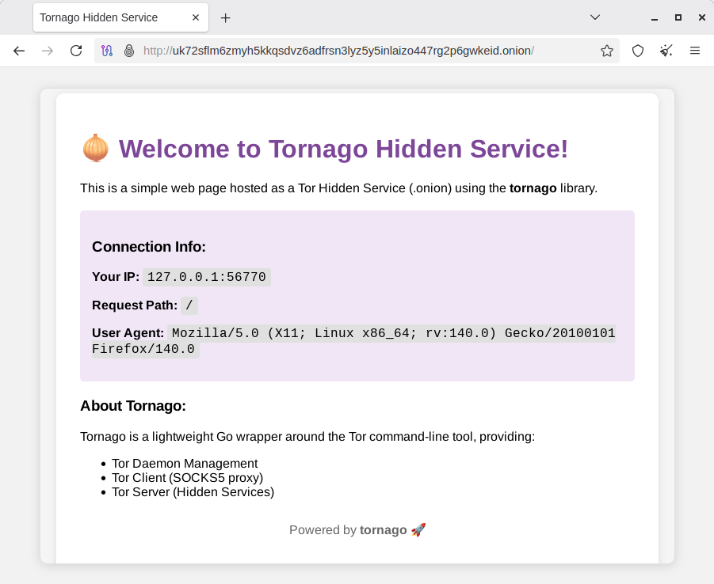

# tornago


Tornago is a lightweight wrapper around the [Tor](https://www.torproject.org/) command-line tool, providing three core functionalities:

- **Tor Daemon Management**: Launch and manage Tor processes programmatically
- **Tor Client**: Route HTTP/TCP traffic through Tor's SOCKS5 proxy with automatic retries
- **Tor Server**: Create and manage Hidden Services (onion services) via Tor's ControlPort

The library is designed for both development (launching ephemeral Tor instances) and production (connecting to existing Tor deployments).

## Why tornago?

I created tornago after learning about the need for dark web crawling in credit card fraud prevention contexts -- I belong to the anti-fraud team. While Python is commonly used for Tor-based crawling, I prefer Go for its stability and robustness in production environments, so I wanted a Go library for this purpose.

To prevent potential misuse, tornago is intentionally kept as a thin wrapper around the original Tor command-line tool. I have deliberately limited its convenience features to minimize the risk of abuse.

> [!IMPORTANT]
> **Legal Notice**: This library is intended for legitimate purposes only, such as privacy protection, security research, and authorized fraud prevention activities. Users are solely responsible for ensuring their use of Tor and this library complies with all applicable laws and regulations. Do not use this tool for any illegal activities.

## Requirements

### Go

- **Go Version**: 1.25 or later

### Operating Systems

- **Primary Support**: Linux
- **Status**: The library has not been tested for compatibility with Windows and macOS, though it may work on systems where Tor is available.

### Tor

Tornago requires the Tor daemon to be installed on your system. The library has been tested with Tor version 0.4.8.x and should work with newer versions.

**Installation:**

```bash
# Ubuntu/Debian
sudo apt update
sudo apt install tor

# Fedora/RHEL
sudo dnf install tor

# Arch Linux
sudo pacman -S tor

# macOS (Homebrew)
brew install tor
```

After installation, verify Tor is available:

```bash
tor --version
```

**Tor Protocol Version**: Tornago uses the Tor ControlPort protocol and supports SOCKS5 proxy (version 5). It is compatible with Tor protocol versions that support:
- ControlPort commands: AUTHENTICATE, GETINFO, SIGNAL NEWNYM, ADD_ONION, DEL_ONION
- Cookie and password authentication methods
- ED25519-V3 onion addresses


## Quick Start

### Access website using tornago

This example demonstrates how to start a Tor daemon and fetch a website through Tor (`examples/simple_client/main.go`):

```go
package main

import (
	"context"
	"fmt"
	"io"
	"log"
	"net/http"
	"time"

	"github.com/nao1215/tornago"
)

func main() {
	// Step 1: Launch Tor daemon
	fmt.Println("Starting Tor daemon...")
	launchCfg, err := tornago.NewTorLaunchConfig(
		tornago.WithTorSocksAddr(":0"),     // Use random available port
		tornago.WithTorControlAddr(":0"),   // Use random available port
		tornago.WithTorStartupTimeout(60*time.Second),
	)
	if err != nil {
		log.Fatalf("Failed to create launch config: %v", err)
	}

	torProcess, err := tornago.StartTorDaemon(launchCfg)
	if err != nil {
		log.Fatalf("Failed to start Tor daemon: %v", err)
	}
	defer torProcess.Stop()

	fmt.Printf("Tor daemon started successfully!\n")
	fmt.Printf("  SOCKS address: %s\n", torProcess.SocksAddr())
	fmt.Printf("  Control address: %s\n", torProcess.ControlAddr())

	// Step 2: Create Tor client
	clientCfg, err := tornago.NewClientConfig(
		tornago.WithClientSocksAddr(torProcess.SocksAddr()),
		tornago.WithClientRequestTimeout(60*time.Second),
	)
	if err != nil {
		log.Fatalf("Failed to create client config: %v", err)
	}

	client, err := tornago.NewClient(clientCfg)
	if err != nil {
		log.Fatalf("Failed to create client: %v", err)
	}
	defer client.Close()

	// Step 3: Make HTTP request through Tor
	fmt.Println("\nFetching https://example.com through Tor...")
	req, err := http.NewRequestWithContext(context.Background(), http.MethodGet, "https://example.com", http.NoBody)
	if err != nil {
		log.Fatalf("Failed to create request: %v", err)
	}

	resp, err := client.Do(req)
	if err != nil {
		log.Fatalf("Request failed: %v", err)
	}
	defer resp.Body.Close()

	fmt.Printf("Status: %s\n", resp.Status)

	body, err := io.ReadAll(io.LimitReader(resp.Body, 500))
	if err != nil {
		log.Fatalf("Failed to read response: %v", err)
	}

	fmt.Printf("\nResponse preview (first 500 bytes):\n%s\n", string(body))
}
```

**Output:**
```
Starting Tor daemon...
Tor daemon started successfully!
  SOCKS address: 127.0.0.1:42715
  Control address: 127.0.0.1:35199

Fetching https://example.com through Tor...
Status: 200 OK

Response preview (first 500 bytes):
<!doctype html><html lang="en"><head><title>Example Domain</title>...
```

### Access .onion using tornago

This example demonstrates how to access a .onion site (DuckDuckGo's onion service) through Tor (`examples/onion_client/main.go`):

```go
package main

import (
	"context"
	"fmt"
	"io"
	"log"
	"net/http"
	"time"

	"github.com/nao1215/tornago"
)

func main() {
	// Step 1: Launch Tor daemon
	fmt.Println("Starting Tor daemon...")
	launchCfg, err := tornago.NewTorLaunchConfig(
		tornago.WithTorSocksAddr(":0"),   // Use random available port
		tornago.WithTorControlAddr(":0"), // Use random available port
		tornago.WithTorStartupTimeout(60*time.Second),
	)
	if err != nil {
		log.Fatalf("Failed to create launch config: %v", err)
	}

	torProcess, err := tornago.StartTorDaemon(launchCfg)
	if err != nil {
		log.Fatalf("Failed to start Tor daemon: %v", err)
	}
	defer torProcess.Stop()

	fmt.Printf("Tor daemon started successfully!\n")
	fmt.Printf("  SOCKS address: %s\n", torProcess.SocksAddr())
	fmt.Printf("  Control address: %s\n", torProcess.ControlAddr())

	// Step 2: Create Tor client
	clientCfg, err := tornago.NewClientConfig(
		tornago.WithClientSocksAddr(torProcess.SocksAddr()),
		tornago.WithClientRequestTimeout(60*time.Second),
	)
	if err != nil {
		log.Fatalf("Failed to create client config: %v", err)
	}

	client, err := tornago.NewClient(clientCfg)
	if err != nil {
		log.Fatalf("Failed to create client: %v", err)
	}
	defer client.Close()

	// Step 3: Access .onion site (DuckDuckGo)
	onionURL := "https://duckduckgogg42xjoc72x3sjasowoarfbgcmvfimaftt6twagswzczad.onion/"
	fmt.Printf("\nAccessing DuckDuckGo onion service: %s\n", onionURL)

	req, err := http.NewRequestWithContext(context.Background(), http.MethodGet, onionURL, http.NoBody)
	if err != nil {
		log.Fatalf("Failed to create request: %v", err)
	}

	resp, err := client.Do(req)
	if err != nil {
		log.Fatalf("Request failed: %v", err)
	}
	defer resp.Body.Close()

	fmt.Printf("Status: %s\n", resp.Status)

	body, err := io.ReadAll(io.LimitReader(resp.Body, 500))
	if err != nil {
		log.Fatalf("Failed to read response: %v", err)
	}

	fmt.Printf("\nResponse preview (first 500 bytes):\n%s\n", string(body))
}
```

**Output:**
```
Starting Tor daemon...
Tor daemon started successfully!
  SOCKS address: 127.0.0.1:42369
  Control address: 127.0.0.1:46475

Accessing DuckDuckGo onion service: https://duckduckgogg42xjoc72x3sjasowoarfbgcmvfimaftt6twagswzczad.onion/
Status: 200 OK

Response preview (first 500 bytes):
<!DOCTYPE html><html lang="en-US" class=""><head><meta charSet="utf-8"...
```

### Host .onion using tornago

This example demonstrates how to create a Hidden Service (.onion) and serve a webpage through Tor (`examples/onion_server/main.go`):

```go
package main

import (
	"context"
	"fmt"
	"log"
	"net"
	"net/http"
	"os"
	"os/signal"
	"syscall"
	"time"

	"github.com/nao1215/tornago"
)

func main() {
	// Step 1: Launch Tor daemon
	fmt.Println("Starting Tor daemon...")
	launchCfg, err := tornago.NewTorLaunchConfig(
		tornago.WithTorSocksAddr(":0"),
		tornago.WithTorControlAddr(":0"),
		tornago.WithTorStartupTimeout(60*time.Second),
	)
	if err != nil {
		log.Fatalf("Failed to create launch config: %v", err)
	}

	torProcess, err := tornago.StartTorDaemon(launchCfg)
	if err != nil {
		log.Fatalf("Failed to start Tor daemon: %v", err)
	}
	defer torProcess.Stop()

	fmt.Printf("Tor daemon started successfully!\n")

	// Step 2: Start local HTTP server
	localAddr := "127.0.0.1:8080"
	mux := http.NewServeMux()
	mux.HandleFunc("/", func(w http.ResponseWriter, r *http.Request) {
		html := `<!DOCTYPE html>
<html><head><title>Tornago Hidden Service</title></head>
<body><h1>Welcome to Tornago Hidden Service!</h1>
<p>This is served through Tor as a .onion site.</p></body></html>`
		w.Header().Set("Content-Type", "text/html; charset=utf-8")
		fmt.Fprint(w, html)
	})

	server := &http.Server{
		Addr:              localAddr,
		Handler:           mux,
		ReadHeaderTimeout: 5 * time.Second,
	}

	listener, err := net.Listen("tcp", localAddr)
	if err != nil {
		log.Fatalf("Failed to start HTTP server: %v", err)
	}

	go server.Serve(listener)
	fmt.Printf("Local HTTP server started on http://%s\n", localAddr)

	// Step 3: Get control authentication
	fmt.Println("Obtaining Tor control authentication...")
	_, cookiePath, err := tornago.ControlAuthFromTor(torProcess.ControlAddr(), 30*time.Second)
	if err != nil {
		log.Fatalf("Failed to get control auth: %v", err)
	}

	// Step 4: Create Hidden Service
	clientCfg, err := tornago.NewClientConfig(
		tornago.WithClientSocksAddr(torProcess.SocksAddr()),
		tornago.WithClientControlAddr(torProcess.ControlAddr()),
		tornago.WithClientControlCookie(cookiePath),
	)
	if err != nil {
		log.Fatalf("Failed to create client config: %v", err)
	}

	client, err := tornago.NewClient(clientCfg)
	if err != nil {
		log.Fatalf("Failed to create client: %v", err)
	}
	defer client.Close()

	if err := client.Control().Authenticate(); err != nil {
		log.Fatalf("Failed to authenticate with Tor: %v", err)
	}

	hsCfg, err := tornago.NewHiddenServiceConfig(
		tornago.WithHiddenServicePort(80, 8080), // Map onion port 80 to local port 8080
	)
	if err != nil {
		log.Fatalf("Failed to create hidden service config: %v", err)
	}

	fmt.Println("Creating Hidden Service...")
	hs, err := client.Control().CreateHiddenService(context.Background(), hsCfg)
	if err != nil {
		log.Fatalf("Failed to create hidden service: %v", err)
	}
	defer hs.Remove(context.Background())

	fmt.Printf("\n✅ Hidden Service created successfully!\n")
	fmt.Printf("   Onion Address: http://%s\n", hs.OnionAddress())
	fmt.Printf("   Local Address: http://%s\n", localAddr)
	fmt.Println("\nAccess the hidden service through Tor using the onion address above.")
	fmt.Println("Press Ctrl+C to stop...")

	// Wait for interrupt signal
	sigChan := make(chan os.Signal, 1)
	signal.Notify(sigChan, os.Interrupt, syscall.SIGTERM)
	<-sigChan

	fmt.Println("\nShutting down...")
	server.Shutdown(context.Background())
}
```

**Output:**
```
Starting Tor daemon...
Tor daemon started successfully!
  SOCKS address: 127.0.0.1:36065
  Control address: 127.0.0.1:37285

Local HTTP server started on http://127.0.0.1:8080

Obtaining Tor control authentication...

Creating Hidden Service...

✅ Hidden Service created successfully!
   Onion Address: http://f64ekih3d23wxhdb547wfj7nornjw5nb3ehuu4do45tw2wwmuzhad3yd.onion
   Local Address: http://127.0.0.1:8080

Access the hidden service through Tor using the onion address above.
Press Ctrl+C to stop...
```

You can now access your hidden service through Tor Browser or any Tor client using the generated .onion address!




## Contributing
Contributions are welcome! Please see the [Contributing Guide](./CONTRIBUTING.md) for more details.

## Support
If you find this project useful, please consider:

- Giving it a star on GitHub - it helps others discover the project
- [Becoming a sponsor](https://github.com/sponsors/nao1215) - your support keeps the project alive and motivates continued development

Your support, whether through stars, sponsorships, or contributions, is what drives this project forward. Thank you!

## License

[MIT License](./LICENSE)

## Altenative Library, Official references

- [cretz/bine](https://github.com/cretz/bine): Go library for accessing and embedding Tor clients and servers.
- [wybiral/torgo](https://github.com/wybiral/torgo):  Go library for interacting with Tor over the standard controller interface.
- [torproject/stem](https://github.com/torproject/stem): Python controller library for Tor
- [Tor Official Wiki](https://gitlab.torproject.org/tpo/team/-/wikis/home)
