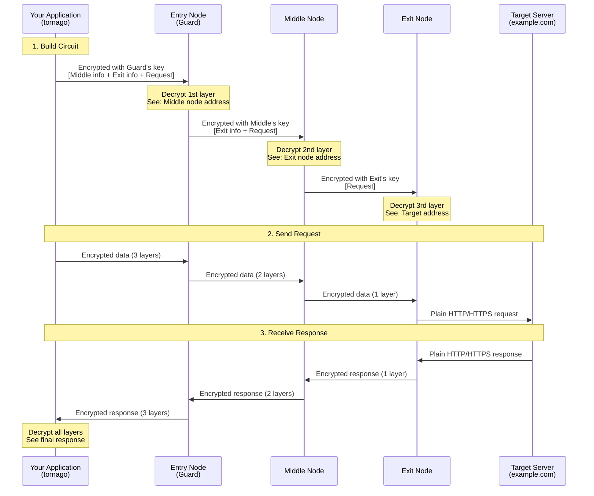
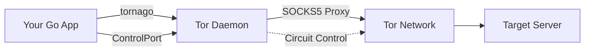
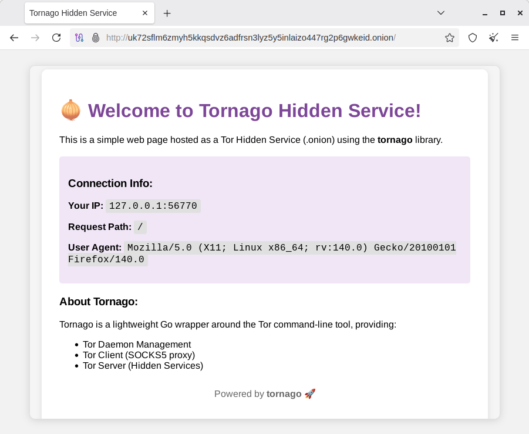
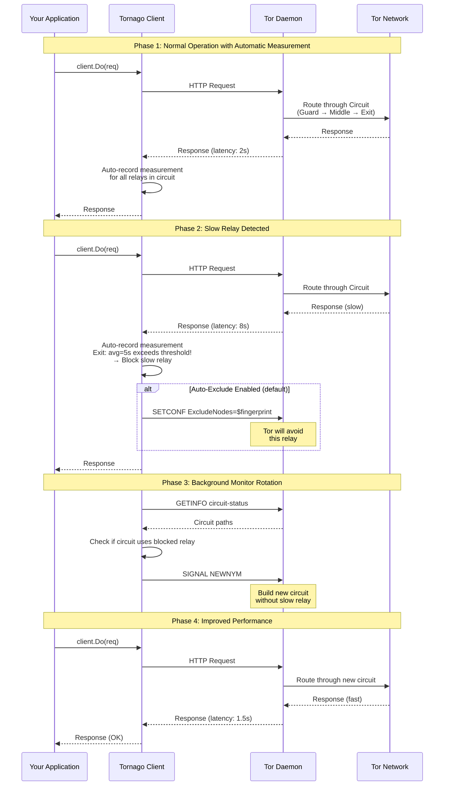

[](https://pkg.go.dev/github.com/nao1215/tornago)
[](https://goreportcard.com/report/github.com/nao1215/tornago)


[日本語](./doc/ja/README.md) | [Español](./doc/es/README.md) | [Français](./doc/fr/README.md) | [한국어](./doc/ko/README.md) | [Русский](./doc/ru/README.md) | [中文](./doc/zh-cn/README.md)

# tornago


Tornago is a lightweight wrapper around the [Tor](https://www.torproject.org/) command-line tool, providing three core functionalities:

- **Tor Daemon Management**: Launch and manage Tor processes programmatically
- **Tor Client**: Route HTTP/TCP traffic through Tor's SOCKS5 proxy with automatic retries
- **Tor Server**: Create and manage Hidden Services (onion services) via Tor's ControlPort

The library is designed for both development (launching ephemeral Tor instances) and production (connecting to existing Tor deployments). Tested successfully across linux, macOS, Windows and major BSD variants.

## Why tornago?

I created tornago after learning about the need for dark web crawling in credit card fraud prevention contexts -- I belong to the anti-fraud team. While Python is commonly used for Tor-based crawling, I prefer Go for its stability and robustness in production environments, so I wanted a Go library for this purpose.

To prevent potential misuse, tornago is intentionally kept as a thin wrapper around the original Tor command-line tool. I have deliberately limited its convenience features to minimize the risk of abuse.

> [!IMPORTANT]
> **Legal Notice**: This library is intended for legitimate purposes only, such as privacy protection, security research, and authorized fraud prevention activities. Users are solely responsible for ensuring their use of Tor and this library complies with all applicable laws and regulations. Do not use this tool for any illegal activities.


## Features

- Zero external Go dependencies. Built on standard library only.
- `net.Listener`, `net.Addr`, `net.Dialer` compatible interfaces for easy integration.
- Functional options pattern for configuration.
- Structured errors with `errors.Is`/`errors.As` support.
- Automatic retry with exponential backoff.
- Optional metrics collection and rate limiting.
- Only requires Tor binary as external dependency.

## How Tor Works

Tor (The Onion Router) provides anonymity by routing traffic through multiple encrypted layers. Understanding this mechanism helps you use tornago effectively.

### Onion Routing: Multi-Layer Encryption


```mermaid
sequenceDiagram
    participant Client as Your Application<br/>(tornago)
    participant Guard as Entry Node<br/>(Guard)
    participant Middle as Middle Node
    participant Exit as Exit Node
    participant Target as Target Server<br/>(example.com)

    Note over Client: 1. Build Circuit
    Client->>Guard: Encrypted with Guard's key<br/>[Middle info + Exit info + Request]
    Note over Guard: Decrypt 1st layer<br/>See: Middle node address
    Guard->>Middle: Encrypted with Middle's key<br/>[Exit info + Request]
    Note over Middle: Decrypt 2nd layer<br/>See: Exit node address
    Middle->>Exit: Encrypted with Exit's key<br/>[Request]
    Note over Exit: Decrypt 3rd layer<br/>See: Target address

    Note over Client,Target: 2. Send Request
    Client->>Guard: Encrypted data (3 layers)
    Guard->>Middle: Encrypted data (2 layers)
    Middle->>Exit: Encrypted data (1 layer)
    Exit->>Target: Plain HTTP/HTTPS request

    Note over Client,Target: 3. Receive Response
    Target->>Exit: Plain HTTP/HTTPS response
    Exit->>Middle: Encrypted response (1 layer)
    Middle->>Guard: Encrypted response (2 layers)
    Guard->>Client: Encrypted response (3 layers)
    Note over Client: Decrypt all layers<br/>See final response
```

### Key Security Properties

**Layered Encryption (Onion Layers)**
- Each relay only knows its immediate predecessor and successor
- Entry node (Guard) knows your IP but not your destination
- Exit node knows your destination but not your IP
- Middle node knows neither your IP nor destination

**Privacy Guarantees**
- Your ISP sees: You connect to a Tor entry node (but not what you're accessing)
- Entry node sees: Your IP address (but not your destination)
- Middle node sees: Only relay traffic (no source or destination)
- Exit node sees: Your destination (but not your real IP)
- Target server sees: Exit node's IP (not your real IP)

**Limitations to Understand**
- Exit node can see unencrypted traffic (use HTTPS for end-to-end encryption)
- Exit node operators could monitor traffic (but can't trace back to you)
- Timing analysis might correlate traffic patterns (Tor provides anonymity, not perfect unlinkability)
- Slower than direct connection (3-hop routing adds latency)

### Tornago's Role

Tornago simplifies Tor integration by handling:

1. **SOCKS5 Proxy Communication**: Automatically routes your HTTP/TCP traffic through Tor's SOCKS5 proxy
2. **Circuit Management**: Uses ControlPort to rotate circuits (get new exit nodes)
3. **Hidden Service Creation**: Manages .onion addresses via ADD_ONION/DEL_ONION commands


```mermaid
graph LR
    A[Your Go App] -->|tornago| B[Tor Daemon]
    B -->|SOCKS5 Proxy| C[Tor Network]
    C --> D[Target Server]

    A -->|ControlPort| B
    B -.->|Circuit Control| C
```

## Requirements

### Go

- **Go Version**: 1.25 or later

### Operating Systems (Tested in GitHub Actions)

- Linux
- macOS
- Windows
- FreeBSD
- OpenBSD
- NetBSD
- DragonFly BSD

### Tor

Tornago requires the Tor daemon to be installed on your system. The library has been tested with Tor version 0.4.8.x and should work with newer versions.

**Installation:**

```bash
# Ubuntu/Debian
sudo apt update
sudo apt install tor

# Fedora/RHEL
sudo dnf install tor

# Arch Linux
sudo pacman -S tor

# macOS (Homebrew)
brew install tor
```

After installation, verify Tor is available:

```bash
tor --version
```

**Tor Protocol Version**: Tornago uses the Tor ControlPort protocol and supports SOCKS5 proxy (version 5). It is compatible with Tor protocol versions that support:
- ControlPort commands: AUTHENTICATE, GETINFO, SIGNAL NEWNYM, ADD_ONION, DEL_ONION
- Cookie and password authentication methods
- ED25519-V3 onion addresses

## Quick Start

### Access website using tornago

This example demonstrates how to start a Tor daemon and fetch a website through Tor (`examples/simple_client/main.go`):

```go
package main

import (
	"context"
	"fmt"
	"io"
	"log"
	"net/http"
	"time"

	"github.com/nao1215/tornago"
)

func main() {
	// Step 1: Launch Tor daemon
	fmt.Println("Starting Tor daemon...")
	launchCfg, err := tornago.NewTorLaunchConfig(
		tornago.WithTorSocksAddr(":0"),     // Use random available port
		tornago.WithTorControlAddr(":0"),   // Use random available port
		tornago.WithTorStartupTimeout(60*time.Second),
	)
	if err != nil {
		log.Fatalf("Failed to create launch config: %v", err)
	}

	torProcess, err := tornago.StartTorDaemon(launchCfg)
	if err != nil {
		log.Fatalf("Failed to start Tor daemon: %v", err)
	}
	defer torProcess.Stop()

	fmt.Printf("Tor daemon started successfully!\n")
	fmt.Printf("  SOCKS address: %s\n", torProcess.SocksAddr())
	fmt.Printf("  Control address: %s\n", torProcess.ControlAddr())

	// Step 2: Create Tor client
	clientCfg, err := tornago.NewClientConfig(
		tornago.WithClientSocksAddr(torProcess.SocksAddr()),
		tornago.WithClientRequestTimeout(60*time.Second),
	)
	if err != nil {
		log.Fatalf("Failed to create client config: %v", err)
	}

	client, err := tornago.NewClient(clientCfg)
	if err != nil {
		log.Fatalf("Failed to create client: %v", err)
	}
	defer client.Close()

	// Step 3: Make HTTP request through Tor
	fmt.Println("\nFetching https://example.com through Tor...")
	req, err := http.NewRequestWithContext(context.Background(), http.MethodGet, "https://example.com", http.NoBody)
	if err != nil {
		log.Fatalf("Failed to create request: %v", err)
	}

	resp, err := client.Do(req)
	if err != nil {
		log.Fatalf("Request failed: %v", err)
	}
	defer resp.Body.Close()

	fmt.Printf("Status: %s\n", resp.Status)

	body, err := io.ReadAll(io.LimitReader(resp.Body, 500))
	if err != nil {
		log.Fatalf("Failed to read response: %v", err)
	}

	fmt.Printf("\nResponse preview (first 500 bytes):\n%s\n", string(body))
}
```

**Output:**
```
Starting Tor daemon...
Tor daemon started successfully!
  SOCKS address: 127.0.0.1:42715
  Control address: 127.0.0.1:35199

Fetching https://example.com through Tor...
Status: 200 OK

Response preview (first 500 bytes):
<!doctype html><html lang="en"><head><title>Example Domain</title>...
```

### Access .onion using tornago

This example demonstrates how to access a .onion site (DuckDuckGo's onion service) through Tor (`examples/onion_client/main.go`):

```go
package main

import (
	"context"
	"fmt"
	"io"
	"log"
	"net/http"
	"time"

	"github.com/nao1215/tornago"
)

func main() {
	// Step 1: Launch Tor daemon
	fmt.Println("Starting Tor daemon...")
	launchCfg, err := tornago.NewTorLaunchConfig(
		tornago.WithTorSocksAddr(":0"),   // Use random available port
		tornago.WithTorControlAddr(":0"), // Use random available port
		tornago.WithTorStartupTimeout(60*time.Second),
	)
	if err != nil {
		log.Fatalf("Failed to create launch config: %v", err)
	}

	torProcess, err := tornago.StartTorDaemon(launchCfg)
	if err != nil {
		log.Fatalf("Failed to start Tor daemon: %v", err)
	}
	defer torProcess.Stop()

	fmt.Printf("Tor daemon started successfully!\n")
	fmt.Printf("  SOCKS address: %s\n", torProcess.SocksAddr())
	fmt.Printf("  Control address: %s\n", torProcess.ControlAddr())

	// Step 2: Create Tor client
	clientCfg, err := tornago.NewClientConfig(
		tornago.WithClientSocksAddr(torProcess.SocksAddr()),
		tornago.WithClientRequestTimeout(60*time.Second),
	)
	if err != nil {
		log.Fatalf("Failed to create client config: %v", err)
	}

	client, err := tornago.NewClient(clientCfg)
	if err != nil {
		log.Fatalf("Failed to create client: %v", err)
	}
	defer client.Close()

	// Step 3: Access .onion site (DuckDuckGo)
	onionURL := "https://duckduckgogg42xjoc72x3sjasowoarfbgcmvfimaftt6twagswzczad.onion/"
	fmt.Printf("\nAccessing DuckDuckGo onion service: %s\n", onionURL)

	req, err := http.NewRequestWithContext(context.Background(), http.MethodGet, onionURL, http.NoBody)
	if err != nil {
		log.Fatalf("Failed to create request: %v", err)
	}

	resp, err := client.Do(req)
	if err != nil {
		log.Fatalf("Request failed: %v", err)
	}
	defer resp.Body.Close()

	fmt.Printf("Status: %s\n", resp.Status)

	body, err := io.ReadAll(io.LimitReader(resp.Body, 500))
	if err != nil {
		log.Fatalf("Failed to read response: %v", err)
	}

	fmt.Printf("\nResponse preview (first 500 bytes):\n%s\n", string(body))
}
```

**Output:**
```
Starting Tor daemon...
Tor daemon started successfully!
  SOCKS address: 127.0.0.1:42369
  Control address: 127.0.0.1:46475

Accessing DuckDuckGo onion service: https://duckduckgogg42xjoc72x3sjasowoarfbgcmvfimaftt6twagswzczad.onion/
Status: 200 OK

Response preview (first 500 bytes):
<!DOCTYPE html><html lang="en-US" class=""><head><meta charSet="utf-8"...
```

### Host .onion using tornago

This example demonstrates how to create a Hidden Service (.onion) and serve a webpage through Tor (`examples/onion_server/main.go`):

```go
package main

import (
	"context"
	"fmt"
	"log"
	"net"
	"net/http"
	"os"
	"os/signal"
	"syscall"
	"time"

	"github.com/nao1215/tornago"
)

func main() {
	// Step 1: Launch Tor daemon
	fmt.Println("Starting Tor daemon...")
	launchCfg, err := tornago.NewTorLaunchConfig(
		tornago.WithTorSocksAddr(":0"),   // Use random available port
		tornago.WithTorControlAddr(":0"), // Use random available port
		tornago.WithTorStartupTimeout(60*time.Second),
	)
	if err != nil {
		log.Fatalf("Failed to create launch config: %v", err)
	}

	torProcess, err := tornago.StartTorDaemon(launchCfg)
	if err != nil {
		log.Fatalf("Failed to start Tor daemon: %v", err)
	}
	defer torProcess.Stop()

	fmt.Printf("Tor daemon started successfully!\n")
	fmt.Printf("  SOCKS address: %s\n", torProcess.SocksAddr())
	fmt.Printf("  Control address: %s\n", torProcess.ControlAddr())

	// Step 2: Start local HTTP server
	localAddr := "127.0.0.1:8080"
	mux := http.NewServeMux()
	mux.HandleFunc("/", func(w http.ResponseWriter, r *http.Request) {
		html := `<!DOCTYPE html>
<html>
<head>
    <title>Tornago Hidden Service</title>
    <style>
        body {
            font-family: Arial, sans-serif;
            max-width: 800px;
            margin: 50px auto;
            padding: 20px;
            background-color: #f5f5f5;
        }
        .container {
            background-color: white;
            padding: 30px;
            border-radius: 10px;
            box-shadow: 0 2px 10px rgba(0,0,0,0.1);
        }
        h1 {
            color: #7d4698;
        }
        .info {
            background-color: #f0e6f6;
            padding: 15px;
            border-radius: 5px;
            margin: 20px 0;
        }
        code {
            background-color: #e0e0e0;
            padding: 2px 6px;
            border-radius: 3px;
            font-family: monospace;
        }
    </style>
</head>
<body>
    <div class="container">
        <h1>🧅 Welcome to Tornago Hidden Service!</h1>
        <p>This is a simple web page hosted as a Tor Hidden Service (.onion) using the <strong>tornago</strong> library.</p>

        <div class="info">
            <h3>Connection Info:</h3>
            <p><strong>Your IP:</strong> <code>` + r.RemoteAddr + `</code></p>
            <p><strong>Request Path:</strong> <code>` + r.URL.Path + `</code></p>
            <p><strong>User Agent:</strong> <code>` + r.UserAgent() + `</code></p>
        </div>

        <h3>About Tornago:</h3>
        <p>Tornago is a lightweight Go wrapper around the Tor command-line tool, providing:</p>
        <ul>
            <li>Tor Daemon Management</li>
            <li>Tor Client (SOCKS5 proxy)</li>
            <li>Tor Server (Hidden Services)</li>
        </ul>

        <p style="margin-top: 30px; text-align: center; color: #666;">
            Powered by <strong>tornago</strong> 🚀
        </p>
    </div>
</body>
</html>`
		w.Header().Set("Content-Type", "text/html; charset=utf-8")
		fmt.Fprint(w, html)
	})

	server := &http.Server{
		Addr:              localAddr,
		Handler:           mux,
		ReadHeaderTimeout: 5 * time.Second,
	}

	lc := net.ListenConfig{}
	listener, err := lc.Listen(context.Background(), "tcp", localAddr)
	if err != nil {
		log.Fatalf("Failed to start HTTP server: %v", err)
	}

	go func() {
		if err := server.Serve(listener); err != nil && err != http.ErrServerClosed {
			log.Fatalf("HTTP server error: %v", err)
		}
	}()

	fmt.Printf("\nLocal HTTP server started on http://%s\n", localAddr)

	// Step 3: Get control authentication and create ControlClient directly
	fmt.Println("\nObtaining Tor control authentication...")
	auth, _, err := tornago.ControlAuthFromTor(torProcess.ControlAddr(), 30*time.Second)
	if err != nil {
		log.Fatalf("Failed to get control auth: %v", err)
	}

	// Step 4: Create ControlClient directly (instead of via tornago.Client)
	controlClient, err := tornago.NewControlClient(
		torProcess.ControlAddr(),
		auth,
		30*time.Second,
	)
	if err != nil {
		log.Fatalf("Failed to create control client: %v", err)
	}
	defer controlClient.Close()

	if err := controlClient.Authenticate(); err != nil {
		log.Fatalf("Failed to authenticate with Tor: %v", err)
	}

	// Step 5: Create Hidden Service
	hsCfg, err := tornago.NewHiddenServiceConfig(
		tornago.WithHiddenServicePort(80, 8080), // Map onion port 80 to local port 8080
	)
	if err != nil {
		log.Fatalf("Failed to create hidden service config: %v", err)
	}

	fmt.Println("\nCreating Hidden Service...")
	hs, err := controlClient.CreateHiddenService(context.Background(), hsCfg)
	if err != nil {
		log.Fatalf("Failed to create hidden service: %v", err)
	}
	defer func() {
		if err := hs.Remove(context.Background()); err != nil {
			log.Printf("Failed to delete hidden service: %v", err)
		}
	}()

	fmt.Printf("\n✅ Hidden Service created successfully!\n")
	fmt.Printf("   Onion Address: http://%s\n", hs.OnionAddress())
	fmt.Printf("   Local Address: http://%s\n", localAddr)
	fmt.Println("\nYou can access this hidden service through Tor using the onion address above.")
	fmt.Println("Press Ctrl+C to stop the server...")

	// Wait for interrupt signal
	sigChan := make(chan os.Signal, 1)
	signal.Notify(sigChan, os.Interrupt, syscall.SIGTERM)
	<-sigChan

	fmt.Println("\n\nShutting down...")
	ctx, cancel := context.WithTimeout(context.Background(), 5*time.Second)
	defer cancel()
	if err := server.Shutdown(ctx); err != nil {
		log.Printf("Server shutdown error: %v", err)
	}
}
```

**Output:**
```
Starting Tor daemon...
Tor daemon started successfully!
  SOCKS address: 127.0.0.1:36065
  Control address: 127.0.0.1:37285

Local HTTP server started on http://127.0.0.1:8080

Obtaining Tor control authentication...

Creating Hidden Service...

✅ Hidden Service created successfully!
   Onion Address: http://f64ekih3d23wxhdb547wfj7nornjw5nb3ehuu4do45tw2wwmuzhad3yd.onion
   Local Address: http://127.0.0.1:8080

Access the hidden service through Tor using the onion address above.
Press Ctrl+C to stop...
```

You can now access your hidden service through Tor Browser or any Tor client using the generated .onion address!



## Slow Relay Avoidance

Tornago includes an automatic performance tracking system that detects and avoids slow Tor relays. Simply enable it with one option and the client handles everything internally.

### Basic Usage (Recommended)

```go
// Create client with slow relay avoidance enabled
client, err := tornago.NewClient(
    tornago.WithClientSocksAddr(torProcess.SocksAddr()),
    tornago.WithClientControlAddr(torProcess.ControlAddr()),
    tornago.WithSlowRelayAvoidance(),  // Enable with defaults
)
if err != nil {
    log.Fatal(err)
}
defer client.Close()

// Make requests normally - everything is handled automatically
resp, err := client.Do(req)

// Optionally check performance statistics
stats, ok := client.RelayPerformanceStats()
if ok {
    fmt.Printf("Tracked: %d, Blocked: %d\n", stats.TrackedRelays(), stats.BlockedRelays())
}
```

### Custom Threshold Configuration

```go
// Enable with custom settings for stricter requirements
client, err := tornago.NewClient(
    tornago.WithClientSocksAddr(torProcess.SocksAddr()),
    tornago.WithClientControlAddr(torProcess.ControlAddr()),
    tornago.WithSlowRelayAvoidance(
        tornago.SlowRelayMaxLatency(3*time.Second),   // Block relays slower than 3s
        tornago.SlowRelayMinSuccessRate(0.9),         // Require 90% success rate
        tornago.SlowRelayBlockDuration(1*time.Hour),  // Block for 1 hour
        tornago.SlowRelayMinSamples(5),               // Need 5 samples before judging
        tornago.SlowRelayMonitorInterval(15*time.Second), // Check every 15s
    ),
)
```

### How It Works


```mermaid
sequenceDiagram
    participant App as Your Application
    participant Client as Tornago Client
    participant Tor as Tor Daemon
    participant Network as Tor Network

    Note over App,Network: Phase 1: Normal Operation with Automatic Measurement

    App->>Client: client.Do(req)
    Client->>Tor: HTTP Request
    Tor->>Network: Route through Circuit<br/>(Guard → Middle → Exit)
    Network-->>Tor: Response
    Tor-->>Client: Response (latency: 2s)
    Client->>Client: Auto-record measurement<br/>for all relays in circuit
    Client-->>App: Response

    Note over App,Network: Phase 2: Slow Relay Detected

    App->>Client: client.Do(req)
    Client->>Tor: HTTP Request
    Tor->>Network: Route through Circuit
    Network-->>Tor: Response (slow)
    Tor-->>Client: Response (latency: 8s)
    Client->>Client: Auto-record measurement<br/>Exit: avg=5s exceeds threshold!<br/>→ Block slow relay

    alt Auto-Exclude Enabled (default)
        Client->>Tor: SETCONF ExcludeNodes=$fingerprint
        Note over Tor: Tor will avoid<br/>this relay
    end

    Client-->>App: Response

    Note over App,Network: Phase 3: Background Monitor Rotation

    Client->>Tor: GETINFO circuit-status
    Tor-->>Client: Circuit paths
    Client->>Client: Check if circuit uses blocked relay
    Client->>Tor: SIGNAL NEWNYM
    Note over Tor: Build new circuit<br/>without slow relay

    Note over App,Network: Phase 4: Improved Performance

    App->>Client: client.Do(req)
    Client->>Tor: HTTP Request
    Tor->>Network: Route through new circuit
    Network-->>Tor: Response (fast)
    Tor-->>Client: Response (latency: 1.5s)
    Client-->>App: Response (OK)
```

### Default Threshold Values

| Parameter | Default | Description |
|-----------|---------|-------------|
| MaxLatency | 5 seconds | Relays slower than this are considered "slow" |
| MinSuccessRate | 80% | Relays with lower success rate are blocked |
| BlockDuration | 30 minutes | How long slow relays remain blocked |
| MinSamples | 3 | Minimum measurements needed before evaluation |
| MonitorInterval | 30 seconds | Background check interval for circuit rotation |
| AutoExclude | true | Automatically update Tor's ExcludeNodes |

See [`examples/slow_relay_avoidance`](examples/slow_relay_avoidance/main.go) for a complete working example.

## More Examples

The `examples/` directory contains additional working examples:

- [`simple_client`](examples/simple_client/main.go) - Basic HTTP requests through Tor
- [`onion_client`](examples/onion_client/main.go) - Accessing .onion sites
- [`onion_server`](examples/onion_server/main.go) - Creating a Hidden Service
- [`existing_tor`](examples/existing_tor/main.go) - Connecting to system Tor daemon
- [`circuit_rotation`](examples/circuit_rotation/main.go) - Rotating circuits to change exit IP
- [`error_handling`](examples/error_handling/main.go) - Proper error handling patterns
- [`metrics_ratelimit`](examples/metrics_ratelimit/main.go) - Metrics collection and rate limiting
- [`persistent_onion`](examples/persistent_onion/main.go) - Hidden Service with persistent key
- [`observability`](examples/observability/main.go) - Structured logging, metrics, and health checks
- [`slow_relay_avoidance`](examples/slow_relay_avoidance/main.go) - Automatic slow relay detection and avoidance

All examples are tested and ready to run.

## Tool using tornago

- [nao1215/onionlint](https://github.com/nao1215/onionlint): Tor site anonymity linter
- [nao1215/onionscan](https://github.com/nao1215/onionscan)：Investigating tool the Dark Web

## Contributing
Contributions are welcome! Please see the [Contributing Guide](./CONTRIBUTING.md) for more details.

## Support
If you find this project useful, please consider:

- Giving it a star on GitHub - it helps others discover the project
- [Becoming a sponsor](https://github.com/sponsors/nao1215) - your support keeps the project alive and motivates continued development

Your support, whether through stars, sponsorships, or contributions, is what drives this project forward. Thank you!

## License

[MIT License](./LICENSE)

## Altenative Library, Official references

- [cretz/bine](https://github.com/cretz/bine): Go library for accessing and embedding Tor clients and servers.
- [wybiral/torgo](https://github.com/wybiral/torgo):  Go library for interacting with Tor over the standard controller interface.
- [torproject/stem](https://github.com/torproject/stem): Python controller library for Tor
- [Tor Official Wiki](https://gitlab.torproject.org/tpo/team/-/wikis/home)
