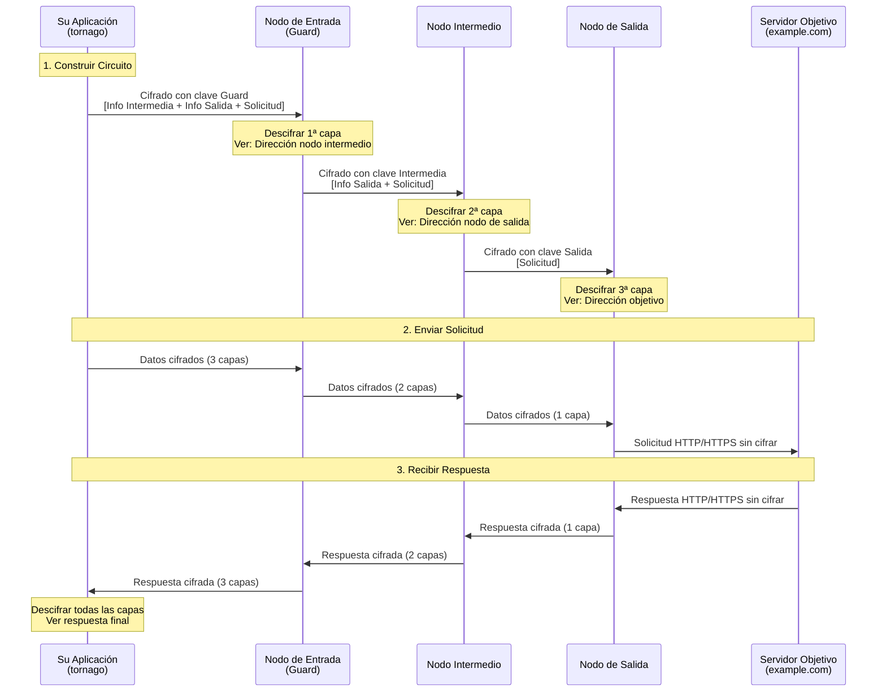

[](https://pkg.go.dev/github.com/nao1215/tornago)
[](https://goreportcard.com/report/github.com/nao1215/tornago)


[English](../../README.md) | [日本語](../ja/README.md) | [Français](../fr/README.md) | [한국어](../ko/README.md) | [Русский](../ru/README.md) | [中文](../zh-cn/README.md)

# tornago


Tornago es un wrapper ligero alrededor de la herramienta de línea de comandos [Tor](https://www.torproject.org/), que proporciona tres funcionalidades principales:

- **Gestión del Daemon Tor**: Iniciar y gestionar procesos Tor programáticamente
- **Cliente Tor**: Enrutar tráfico HTTP/TCP a través del proxy SOCKS5 de Tor con reintentos automáticos
- **Servidor Tor**: Crear y gestionar Servicios Ocultos (servicios onion) a través del ControlPort de Tor

La biblioteca está diseñada tanto para desarrollo (lanzamiento de instancias efímeras de Tor) como para producción (conexión a despliegues de Tor existentes). Probado con éxito en Linux, macOS, Windows y las principales variantes BSD.

## ¿Por qué tornago?

Creé tornago después de conocer la necesidad de rastreo de la web oscura en contextos de prevención de fraude con tarjetas de crédito -- pertenezco al equipo antifraude. Aunque Python se usa comúnmente para rastreo basado en Tor, prefiero Go por su estabilidad y robustez en entornos de producción, así que quería una biblioteca Go para este propósito.

Para prevenir posibles abusos, tornago se mantiene intencionalmente como un wrapper delgado alrededor de la herramienta original de línea de comandos de Tor. He limitado deliberadamente sus características de conveniencia para minimizar el riesgo de abuso.

> [!IMPORTANT]
> **Aviso Legal**: Esta biblioteca está destinada únicamente a propósitos legítimos, como protección de privacidad, investigación de seguridad y actividades autorizadas de prevención de fraude. Los usuarios son los únicos responsables de garantizar que su uso de Tor y esta biblioteca cumple con todas las leyes y regulaciones aplicables. No use esta herramienta para ninguna actividad ilegal.

## Características

- Cero dependencias externas de Go. Construido solo sobre la biblioteca estándar
- Interfaces compatibles con `net.Listener`, `net.Addr`, `net.Dialer` para fácil integración
- Patrón de opciones funcionales para configuración
- Errores estructurados con soporte para `errors.Is`/`errors.As`
- Reintento automático con retroceso exponencial
- Recopilación opcional de métricas y limitación de tasa
- Solo requiere el binario Tor como dependencia externa

## Cómo funciona Tor

Tor (The Onion Router) proporciona anonimato enrutando el tráfico a través de múltiples capas cifradas. Comprender este mecanismo le ayuda a usar tornago de manera efectiva.

### Enrutamiento Cebolla: Cifrado de Múltiples Capas



### Propiedades Clave de Seguridad

**Cifrado por Capas (Capas Cebolla)**
- Cada relé solo conoce su predecesor y sucesor inmediatos
- El nodo de entrada (Guard) conoce su IP pero no su destino
- El nodo de salida conoce su destino pero no su IP
- El nodo intermedio no conoce ni su IP ni su destino

**Garantías de Privacidad**
- Su ISP ve: Usted se conecta a un nodo de entrada de Tor (pero no a qué está accediendo)
- El nodo de entrada ve: Su dirección IP (pero no su destino)
- El nodo intermedio ve: Solo tráfico de relé (sin fuente ni destino)
- El nodo de salida ve: Su destino (pero no su IP real)
- El servidor objetivo ve: IP del nodo de salida (no su IP real)

**Limitaciones a Entender**
- El nodo de salida puede ver tráfico sin cifrar (use HTTPS para cifrado de extremo a extremo)
- Los operadores de nodos de salida podrían monitorear el tráfico (pero no pueden rastrearlo hasta usted)
- El análisis de temporización podría correlacionar patrones de tráfico (Tor proporciona anonimato, no desvinculación perfecta)
- Más lento que la conexión directa (el enrutamiento de 3 saltos añade latencia)

### El Rol de Tornago

Tornago simplifica la integración de Tor manejando:

1. **Comunicación con Proxy SOCKS5**: Enruta automáticamente su tráfico HTTP/TCP a través del proxy SOCKS5 de Tor
2. **Gestión de Circuitos**: Usa ControlPort para rotar circuitos (obtener nuevos nodos de salida)
3. **Creación de Servicios Ocultos**: Gestiona direcciones .onion a través de comandos ADD_ONION/DEL_ONION

## Requisitos

### Go

- **Versión de Go**: 1.25 o posterior

### Sistemas Operativos (Probados en GitHub Actions)

- Linux
- macOS
- Windows
- FreeBSD
- OpenBSD
- NetBSD
- DragonFly BSD

### Tor

Tornago requiere que el daemon Tor esté instalado en su sistema. La biblioteca ha sido probada con Tor versión 0.4.8.x y debería funcionar con versiones más nuevas.

**Instalación:**

```bash
# Ubuntu/Debian
sudo apt update
sudo apt install tor

# Fedora/RHEL
sudo dnf install tor

# Arch Linux
sudo pacman -S tor

# macOS (Homebrew)
brew install tor
```

## Inicio Rápido

Ver [README en inglés](../../README.md#quick-start) para ejemplos de código completos.

## Más Ejemplos

El directorio `examples/` contiene ejemplos funcionales adicionales. Todos los ejemplos están probados y listos para ejecutar.

## Contribuir
¡Las contribuciones son bienvenidas! Consulte la [Guía de Contribución](../../CONTRIBUTING.md) para más detalles.

## Licencia

[Licencia MIT](../../LICENSE)

## Bibliotecas Alternativas, Referencias Oficiales

- [cretz/bine](https://github.com/cretz/bine): Biblioteca Go para acceder e incrustar clientes y servidores Tor
- [wybiral/torgo](https://github.com/wybiral/torgo): Biblioteca Go para interactuar con Tor a través de la interfaz de controlador estándar
- [torproject/stem](https://github.com/torproject/stem): Biblioteca de controlador Python para Tor
- [Wiki Oficial de Tor](https://gitlab.torproject.org/tpo/team/-/wikis/home)
