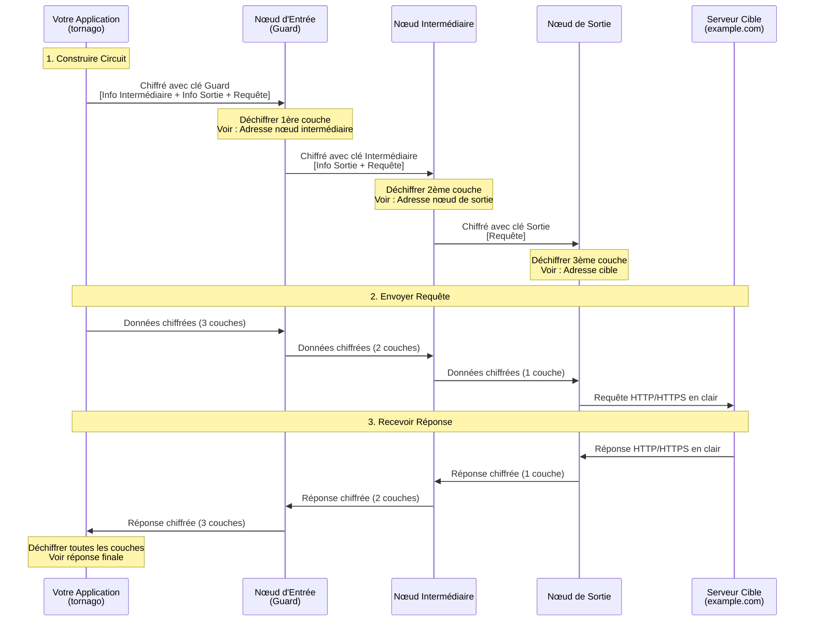

[](https://pkg.go.dev/github.com/nao1215/tornago)
[](https://goreportcard.com/report/github.com/nao1215/tornago)


[English](../../README.md) | [日本語](../ja/README.md) | [Español](../es/README.md) | [한국어](../ko/README.md) | [Русский](../ru/README.md) | [中文](../zh-cn/README.md)

# tornago


Tornago est un wrapper léger autour de l'outil en ligne de commande [Tor](https://www.torproject.org/), fournissant trois fonctionnalités principales :

- **Gestion du Daemon Tor** : Lancer et gérer les processus Tor par programme
- **Client Tor** : Acheminer le trafic HTTP/TCP via le proxy SOCKS5 de Tor avec réessais automatiques
- **Serveur Tor** : Créer et gérer des Services Cachés (services onion) via le ControlPort de Tor

La bibliothèque est conçue à la fois pour le développement (lancement d'instances éphémères de Tor) et la production (connexion aux déploiements Tor existants). Testée avec succès sur Linux, macOS, Windows et les principales variantes BSD.

## Pourquoi tornago ?

J'ai créé tornago après avoir appris le besoin d'exploration du dark web dans les contextes de prévention de la fraude par carte de crédit -- j'appartiens à l'équipe anti-fraude. Bien que Python soit couramment utilisé pour l'exploration basée sur Tor, je préfère Go pour sa stabilité et sa robustesse dans les environnements de production, j'avais donc besoin d'une bibliothèque Go pour cet objectif.

Pour prévenir les abus potentiels, tornago est intentionnellement maintenu comme un wrapper léger autour de l'outil en ligne de commande Tor original. J'ai délibérément limité ses fonctionnalités de commodité pour minimiser le risque d'abus.

> [!IMPORTANT]
> **Avis Légal** : Cette bibliothèque est destinée uniquement à des fins légitimes, telles que la protection de la vie privée, la recherche en sécurité et les activités autorisées de prévention de la fraude. Les utilisateurs sont seuls responsables de s'assurer que leur utilisation de Tor et de cette bibliothèque est conforme à toutes les lois et réglementations applicables. N'utilisez pas cet outil pour des activités illégales.

## Fonctionnalités

- Zéro dépendances externes Go. Construit uniquement sur la bibliothèque standard
- Interfaces compatibles `net.Listener`, `net.Addr`, `net.Dialer` pour une intégration facile
- Modèle d'options fonctionnelles pour la configuration
- Erreurs structurées avec support `errors.Is`/`errors.As`
- Réessai automatique avec backoff exponentiel
- Collecte optionnelle de métriques et limitation de taux
- Nécessite uniquement le binaire Tor comme dépendance externe

## Comment fonctionne Tor

Tor (The Onion Router) fournit l'anonymat en acheminant le trafic à travers plusieurs couches chiffrées. Comprendre ce mécanisme vous aide à utiliser tornago efficacement.

### Routage en Oignon : Chiffrement Multi-Couches



### Propriétés Clés de Sécurité

**Chiffrement par Couches (Couches Oignon)**
- Chaque relais ne connaît que son prédécesseur et son successeur immédiats
- Le nœud d'entrée (Guard) connaît votre IP mais pas votre destination
- Le nœud de sortie connaît votre destination mais pas votre IP
- Le nœud intermédiaire ne connaît ni votre IP ni votre destination

**Garanties de Confidentialité**
- Votre FAI voit : Vous vous connectez à un nœud d'entrée Tor (mais pas ce que vous accédez)
- Le nœud d'entrée voit : Votre adresse IP (mais pas votre destination)
- Le nœud intermédiaire voit : Uniquement le trafic de relais (pas de source ni de destination)
- Le nœud de sortie voit : Votre destination (mais pas votre IP réelle)
- Le serveur cible voit : IP du nœud de sortie (pas votre IP réelle)

**Limitations à Comprendre**
- Le nœud de sortie peut voir le trafic non chiffré (utilisez HTTPS pour le chiffrement de bout en bout)
- Les opérateurs de nœuds de sortie pourraient surveiller le trafic (mais ne peuvent pas vous tracer)
- L'analyse de timing pourrait corréler les modèles de trafic (Tor fournit l'anonymat, pas la dissociation parfaite)
- Plus lent que la connexion directe (le routage à 3 sauts ajoute de la latence)

### Le Rôle de Tornago

Tornago simplifie l'intégration Tor en gérant :

1. **Communication Proxy SOCKS5** : Achemine automatiquement votre trafic HTTP/TCP via le proxy SOCKS5 de Tor
2. **Gestion des Circuits** : Utilise ControlPort pour faire tourner les circuits (obtenir de nouveaux nœuds de sortie)
3. **Création de Services Cachés** : Gère les adresses .onion via les commandes ADD_ONION/DEL_ONION

## Exigences

### Go

- **Version Go** : 1.25 ou ultérieure

### Systèmes d'Exploitation (Testés dans GitHub Actions)

- Linux
- macOS
- Windows
- FreeBSD
- OpenBSD
- NetBSD
- DragonFly BSD

### Tor

Tornago nécessite que le daemon Tor soit installé sur votre système. La bibliothèque a été testée avec Tor version 0.4.8.x et devrait fonctionner avec des versions plus récentes.

**Installation :**

```bash
# Ubuntu/Debian
sudo apt update
sudo apt install tor

# Fedora/RHEL
sudo dnf install tor

# Arch Linux
sudo pacman -S tor

# macOS (Homebrew)
brew install tor
```

## Démarrage Rapide

Voir [README en anglais](../../README.md#quick-start) pour des exemples de code complets.

## Plus d'Exemples

Le répertoire `examples/` contient des exemples fonctionnels supplémentaires. Tous les exemples sont testés et prêts à exécuter.

## Contribuer
Les contributions sont les bienvenues ! Consultez le [Guide de Contribution](../../CONTRIBUTING.md) pour plus de détails.

## Licence

[Licence MIT](../../LICENSE)

## Bibliothèques Alternatives, Références Officielles

- [cretz/bine](https://github.com/cretz/bine) : Bibliothèque Go pour accéder et intégrer des clients et serveurs Tor
- [wybiral/torgo](https://github.com/wybiral/torgo) : Bibliothèque Go pour interagir avec Tor via l'interface de contrôleur standard
- [torproject/stem](https://github.com/torproject/stem) : Bibliothèque de contrôleur Python pour Tor
- [Wiki Officiel Tor](https://gitlab.torproject.org/tpo/team/-/wikis/home)
