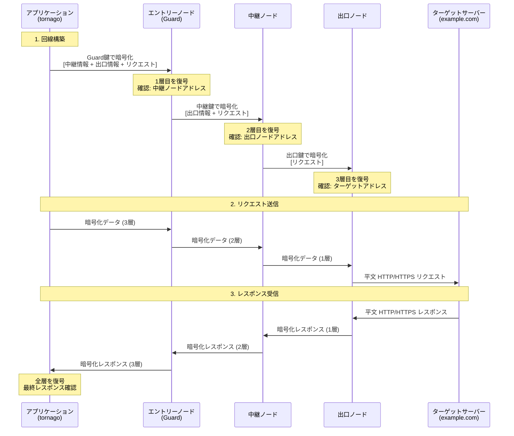
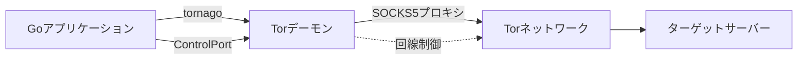

[](https://pkg.go.dev/github.com/nao1215/tornago)
[](https://goreportcard.com/report/github.com/nao1215/tornago)


[English](../../README.md) | [Español](../es/README.md) | [Français](../fr/README.md) | [한국어](../ko/README.md) | [Русский](../ru/README.md) | [中文](../zh-cn/README.md)

# tornago


Tornagoは、[Tor](https://www.torproject.org/)コマンドラインツールの軽量ラッパーで、3つの主要機能を提供します：

- **Torデーモン管理**: Torプロセスをプログラムで起動・管理
- **Torクライアント**: HTTP/TCPトラフィックをTorのSOCKS5プロキシ経由で自動リトライ付きでルーティング
- **Torサーバー**: Tor ControlPort経由でHidden Service（オニオンサービス）を作成・管理

このライブラリは、開発環境（一時的なTorインスタンスの起動）と本番環境（既存のTorデプロイメントへの接続）の両方に対応しています。Linux、macOS、Windows、および主要なBSD系OSで動作確認済みです。

## なぜtornagoを作ったのか？

クレジットカード不正検知の文脈でダークウェブクローリングの必要性を知り、tornagoを作成しました（私は不正対策チームに所属しています）。Torベースのクローリングには一般的にPythonが使われますが、本番環境での安定性と堅牢性からGoを好むため、Go用のライブラリが欲しかったのです。

悪用を防ぐため、tornagoは意図的にTorコマンドラインツールの薄いラッパーとして設計されています。利便性機能は意図的に制限し、悪用リスクを最小化しています。

> [!IMPORTANT]
> **法的通知**: このライブラリは、プライバシー保護、セキュリティ研究、認可された不正防止活動など、合法的な目的のみを対象としています。ユーザーは、Torおよびこのライブラリの使用に適用されるすべての法律と規制に準拠していることを確認する責任があります。違法な活動にこのツールを使用しないでください。

## 機能

- Go外部依存ゼロ。標準ライブラリのみで構築
- `net.Listener`、`net.Addr`、`net.Dialer`互換インターフェースで簡単統合
- Functional Optionsパターンによる設定
- `errors.Is`/`errors.As`対応の構造化エラー
- 指数バックオフによる自動リトライ
- オプションのメトリクス収集とレート制限
- 外部依存はTorバイナリのみ

## Torの仕組み

Tor（The Onion Router）は、複数の暗号化層を経由してトラフィックをルーティングすることで匿名性を提供します。この仕組みを理解することで、tornagoを効果的に使用できます。

### オニオンルーティング：多層暗号化



### 主なセキュリティ特性

**多層暗号化（オニオン層）**
- 各中継ノードは直前と直後のノードのみを認識
- エントリーノード（Guard）はあなたのIPを知っているが宛先は不明
- 出口ノードは宛先を知っているがあなたのIPは不明
- 中継ノードはあなたのIPも宛先も不明

**プライバシー保証**
- ISPが確認できること: Torエントリーノードへの接続（アクセス先は不明）
- エントリーノードが確認できること: あなたのIPアドレス（宛先は不明）
- 中継ノードが確認できること: 中継トラフィックのみ（送信元も宛先も不明）
- 出口ノードが確認できること: 宛先（あなたの実IPは不明）
- ターゲットサーバーが確認できること: 出口ノードのIP（あなたの実IPは不明）

**理解すべき制限事項**
- 出口ノードは暗号化されていないトラフィックを確認可能（エンドツーエンド暗号化にはHTTPSを使用）
- 出口ノード運営者がトラフィックを監視する可能性（ただし送信元の追跡は不可）
- タイミング分析でトラフィックパターンが相関する可能性（Torは匿名性を提供するが完全な追跡不可性ではない）
- 直接接続より遅い（3ホップルーティングでレイテンシが増加）

### Tornagoの役割

Tornagoは以下を処理してTor統合を簡素化します：

1. **SOCKS5プロキシ通信**: HTTP/TCPトラフィックをTorのSOCKS5プロキシ経由で自動ルーティング
2. **回線管理**: ControlPortを使用して回線をローテーション（新しい出口ノードを取得）
3. **Hidden Service作成**: ADD_ONION/DEL_ONIONコマンド経由で.onionアドレスを管理



## 要件

### Go

- **Goバージョン**: 1.25以降

### オペレーティングシステム（GitHub Actionsでテスト済み）

- Linux
- macOS
- Windows
- FreeBSD
- OpenBSD
- NetBSD
- DragonFly BSD

### Tor

TornagoはシステムにインストールされたTorデーモンを必要とします。Torバージョン0.4.8.xでテストされており、新しいバージョンでも動作します。

**インストール:**

```bash
# Ubuntu/Debian
sudo apt update
sudo apt install tor

# Fedora/RHEL
sudo dnf install tor

# Arch Linux
sudo pacman -S tor

# macOS (Homebrew)
brew install tor
```

インストール後、Torが利用可能か確認：

```bash
tor --version
```

**Torプロトコルバージョン**: TornagoはTor ControlPortプロトコルを使用し、SOCKS5プロキシ（バージョン5）をサポートします。以下をサポートするTorプロトコルバージョンと互換性があります：
- ControlPortコマンド: AUTHENTICATE, GETINFO, SIGNAL NEWNYM, ADD_ONION, DEL_ONION
- クッキーおよびパスワード認証方式
- ED25519-V3オニオンアドレス

## クイックスタート

### tornagoを使用してウェブサイトにアクセス

この例では、Torデーモンを起動し、Torを通じてウェブサイトを取得する方法を示します（`examples/simple_client/main.go`）：

```go
package main

import (
	"context"
	"fmt"
	"io"
	"log"
	"net/http"
	"time"

	"github.com/nao1215/tornago"
)

func main() {
	// ステップ1: Torデーモンを起動
	fmt.Println("Starting Tor daemon...")
	launchCfg, err := tornago.NewTorLaunchConfig(
		tornago.WithTorSocksAddr(":0"),     // ランダムポートを使用
		tornago.WithTorControlAddr(":0"),   // ランダムポートを使用
		tornago.WithTorStartupTimeout(60*time.Second),
	)
	if err != nil {
		log.Fatalf("Failed to create launch config: %v", err)
	}

	torProcess, err := tornago.StartTorDaemon(launchCfg)
	if err != nil {
		log.Fatalf("Failed to start Tor daemon: %v", err)
	}
	defer torProcess.Stop()

	fmt.Printf("Tor daemon started successfully!\n")
	fmt.Printf("  SOCKS address: %s\n", torProcess.SocksAddr())
	fmt.Printf("  Control address: %s\n", torProcess.ControlAddr())

	// ステップ2: Torクライアントを作成
	clientCfg, err := tornago.NewClientConfig(
		tornago.WithClientSocksAddr(torProcess.SocksAddr()),
		tornago.WithClientRequestTimeout(60*time.Second),
	)
	if err != nil {
		log.Fatalf("Failed to create client config: %v", err)
	}

	client, err := tornago.NewClient(clientCfg)
	if err != nil {
		log.Fatalf("Failed to create client: %v", err)
	}
	defer client.Close()

	// ステップ3: Tor経由でHTTPリクエスト
	fmt.Println("\nFetching https://example.com through Tor...")
	req, err := http.NewRequestWithContext(context.Background(), http.MethodGet, "https://example.com", http.NoBody)
	if err != nil {
		log.Fatalf("Failed to create request: %v", err)
	}

	resp, err := client.Do(req)
	if err != nil {
		log.Fatalf("Request failed: %v", err)
	}
	defer resp.Body.Close()

	fmt.Printf("Status: %s\n", resp.Status)

	body, err := io.ReadAll(io.LimitReader(resp.Body, 500))
	if err != nil {
		log.Fatalf("Failed to read response: %v", err)
	}

	fmt.Printf("\nResponse preview (first 500 bytes):\n%s\n", string(body))
}
```

**出力:**
```
Starting Tor daemon...
Tor daemon started successfully!
  SOCKS address: 127.0.0.1:42715
  Control address: 127.0.0.1:35199

Fetching https://example.com through Tor...
Status: 200 OK

Response preview (first 500 bytes):
<!doctype html><html lang="en"><head><title>Example Domain</title>...
```

## その他の例

`examples/`ディレクトリには追加の動作例があります：

- [`simple_client`](../../examples/simple_client/main.go) - Tor経由の基本的なHTTPリクエスト
- [`onion_client`](../../examples/onion_client/main.go) - .onionサイトへのアクセス
- [`onion_server`](../../examples/onion_server/main.go) - Hidden Serviceの作成
- [`existing_tor`](../../examples/existing_tor/main.go) - システムTorデーモンへの接続
- [`circuit_rotation`](../../examples/circuit_rotation/main.go) - 回線ローテーションで出口IPを変更
- [`error_handling`](../../examples/error_handling/main.go) - 適切なエラーハンドリングパターン
- [`metrics_ratelimit`](../../examples/metrics_ratelimit/main.go) - メトリクス収集とレート制限
- [`persistent_onion`](../../examples/persistent_onion/main.go) - 永続鍵を使用したHidden Service
- [`observability`](../../examples/observability/main.go) - 構造化ロギング、メトリクス、ヘルスチェック

すべての例はテスト済みで、すぐに実行可能です。

## コントリビューション
コントリビューションを歓迎します！詳細は[コントリビューションガイド](../../CONTRIBUTING.md)をご覧ください。

## サポート
このプロジェクトが役立つと思われた場合は、以下をご検討ください：

- GitHubでスターを付ける - 他の人がプロジェクトを発見する助けになります
- [スポンサーになる](https://github.com/sponsors/nao1215) - あなたのサポートがプロジェクトを継続させ、開発のモチベーションになります

スター、スポンサーシップ、コントリビューションなど、あなたのサポートがこのプロジェクトを前進させます。ありがとうございます！

## ライセンス

[MITライセンス](../../LICENSE)

## 代替ライブラリ、公式リファレンス

- [cretz/bine](https://github.com/cretz/bine): Torクライアントとサーバーにアクセスおよび埋め込むためのGoライブラリ
- [wybiral/torgo](https://github.com/wybiral/torgo): 標準コントローラーインターフェース経由でTorと対話するGoライブラリ
- [torproject/stem](https://github.com/torproject/stem): Tor用Pythonコントローラーライブラリ
- [Tor公式Wiki](https://gitlab.torproject.org/tpo/team/-/wikis/home)
