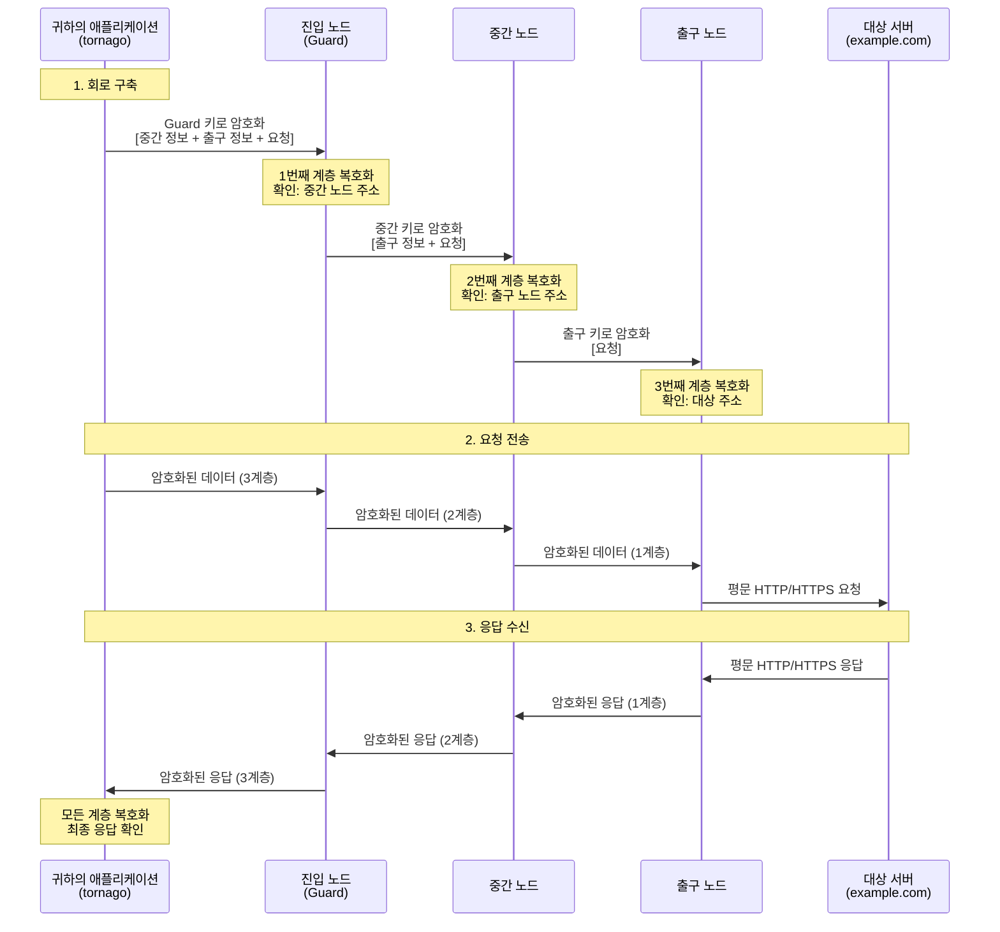

[](https://pkg.go.dev/github.com/nao1215/tornago)
[](https://goreportcard.com/report/github.com/nao1215/tornago)


[English](../../README.md) | [日本語](../ja/README.md) | [Español](../es/README.md) | [Français](../fr/README.md) | [Русский](../ru/README.md) | [中文](../zh-cn/README.md)

# tornago


Tornago는 [Tor](https://www.torproject.org/) 명령줄 도구를 감싸는 경량 래퍼로, 세 가지 핵심 기능을 제공합니다:

- **Tor 데몬 관리**: Tor 프로세스를 프로그래밍 방식으로 시작하고 관리
- **Tor 클라이언트**: 자동 재시도 기능을 갖춘 Tor의 SOCKS5 프록시를 통한 HTTP/TCP 트래픽 라우팅
- **Tor 서버**: Tor의 ControlPort를 통한 히든 서비스(onion 서비스) 생성 및 관리

이 라이브러리는 개발 환경(임시 Tor 인스턴스 시작)과 프로덕션 환경(기존 Tor 배포에 연결) 모두를 위해 설계되었습니다. Linux, macOS, Windows 및 주요 BSD 계열에서 성공적으로 테스트되었습니다.

## 왜 tornago를 만들었나요?

신용카드 사기 방지 맥락에서 다크웹 크롤링의 필요성을 알게 된 후 tornago를 만들었습니다(저는 사기 방지 팀에 속해 있습니다). Tor 기반 크롤링에는 일반적으로 Python이 사용되지만, 프로덕션 환경에서의 안정성과 견고성 때문에 Go를 선호하므로 이 목적을 위한 Go 라이브러리가 필요했습니다.

잠재적인 악용을 방지하기 위해 tornago는 의도적으로 원본 Tor 명령줄 도구의 얇은 래퍼로 유지됩니다. 악용 위험을 최소화하기 위해 편의 기능을 의도적으로 제한했습니다.

> [!IMPORTANT]
> **법적 고지**: 이 라이브러리는 개인정보 보호, 보안 연구 및 승인된 사기 방지 활동과 같은 합법적인 목적으로만 사용됩니다. 사용자는 Tor 및 이 라이브러리의 사용이 모든 관련 법률 및 규정을 준수하는지 확인할 책임이 있습니다. 불법 활동에 이 도구를 사용하지 마십시오.

## 기능

- Go 외부 종속성 없음. 표준 라이브러리만으로 구축
- 쉬운 통합을 위한 `net.Listener`, `net.Addr`, `net.Dialer` 호환 인터페이스
- 구성을 위한 함수형 옵션 패턴
- `errors.Is`/`errors.As` 지원을 갖춘 구조화된 오류
- 지수 백오프를 사용한 자동 재시도
- 선택적 메트릭 수집 및 속도 제한
- 외부 종속성으로 Tor 바이너리만 필요

## Tor 작동 방식

Tor(The Onion Router)는 여러 암호화 계층을 통해 트래픽을 라우팅하여 익명성을 제공합니다. 이 메커니즘을 이해하면 tornago를 효과적으로 사용하는 데 도움이 됩니다.

### 어니언 라우팅: 다층 암호화



### 주요 보안 속성

**계층화된 암호화(어니언 계층)**
- 각 릴레이는 바로 앞과 뒤 노드만 알고 있음
- 진입 노드(Guard)는 귀하의 IP를 알지만 목적지는 모름
- 출구 노드는 목적지를 알지만 귀하의 IP는 모름
- 중간 노드는 귀하의 IP도 목적지도 모름

**개인정보 보장**
- ISP가 볼 수 있는 것: Tor 진입 노드에 연결 (접속 대상은 모름)
- 진입 노드가 볼 수 있는 것: 귀하의 IP 주소 (목적지는 모름)
- 중간 노드가 볼 수 있는 것: 릴레이 트래픽만 (출처도 목적지도 모름)
- 출구 노드가 볼 수 있는 것: 귀하의 목적지 (실제 IP는 모름)
- 대상 서버가 볼 수 있는 것: 출구 노드의 IP (귀하의 실제 IP는 아님)

**이해해야 할 제한사항**
- 출구 노드는 암호화되지 않은 트래픽을 볼 수 있음 (종단간 암호화를 위해 HTTPS 사용)
- 출구 노드 운영자가 트래픽을 모니터링할 수 있음 (하지만 추적은 불가능)
- 타이밍 분석으로 트래픽 패턴을 연관시킬 수 있음 (Tor는 익명성을 제공하지만 완벽한 연결 해제는 아님)
- 직접 연결보다 느림 (3홉 라우팅으로 지연 시간 증가)

### Tornago의 역할

Tornago는 다음을 처리하여 Tor 통합을 단순화합니다:

1. **SOCKS5 프록시 통신**: HTTP/TCP 트래픽을 Tor의 SOCKS5 프록시를 통해 자동으로 라우팅
2. **회로 관리**: ControlPort를 사용하여 회로 순환 (새로운 출구 노드 얻기)
3. **히든 서비스 생성**: ADD_ONION/DEL_ONION 명령을 통한 .onion 주소 관리

## 요구사항

### Go

- **Go 버전**: 1.25 이상

### 운영체제 (GitHub Actions에서 테스트됨)

- Linux
- macOS
- Windows
- FreeBSD
- OpenBSD
- NetBSD
- DragonFly BSD

### Tor

Tornago는 시스템에 Tor 데몬이 설치되어 있어야 합니다. 라이브러리는 Tor 버전 0.4.8.x로 테스트되었으며 최신 버전에서도 작동합니다.

**설치:**

```bash
# Ubuntu/Debian
sudo apt update
sudo apt install tor

# Fedora/RHEL
sudo dnf install tor

# Arch Linux
sudo pacman -S tor

# macOS (Homebrew)
brew install tor
```

## 빠른 시작

전체 코드 예제는 [영문 README](../../README.md#quick-start)를 참조하세요.

## 더 많은 예제

`examples/` 디렉토리에는 추가 작동 예제가 포함되어 있습니다. 모든 예제는 테스트되어 바로 실행할 수 있습니다.

## 기여

기여를 환영합니다! 자세한 내용은 [기여 가이드](../../CONTRIBUTING.md)를 참조하세요.

## 라이선스

[MIT 라이선스](../../LICENSE)

## 대체 라이브러리, 공식 참조

- [cretz/bine](https://github.com/cretz/bine): Tor 클라이언트 및 서버에 액세스하고 임베드하기 위한 Go 라이브러리
- [wybiral/torgo](https://github.com/wybiral/torgo): 표준 컨트롤러 인터페이스를 통해 Tor와 상호작용하는 Go 라이브러리
- [torproject/stem](https://github.com/torproject/stem): Tor용 Python 컨트롤러 라이브러리
- [Tor 공식 Wiki](https://gitlab.torproject.org/tpo/team/-/wikis/home)
