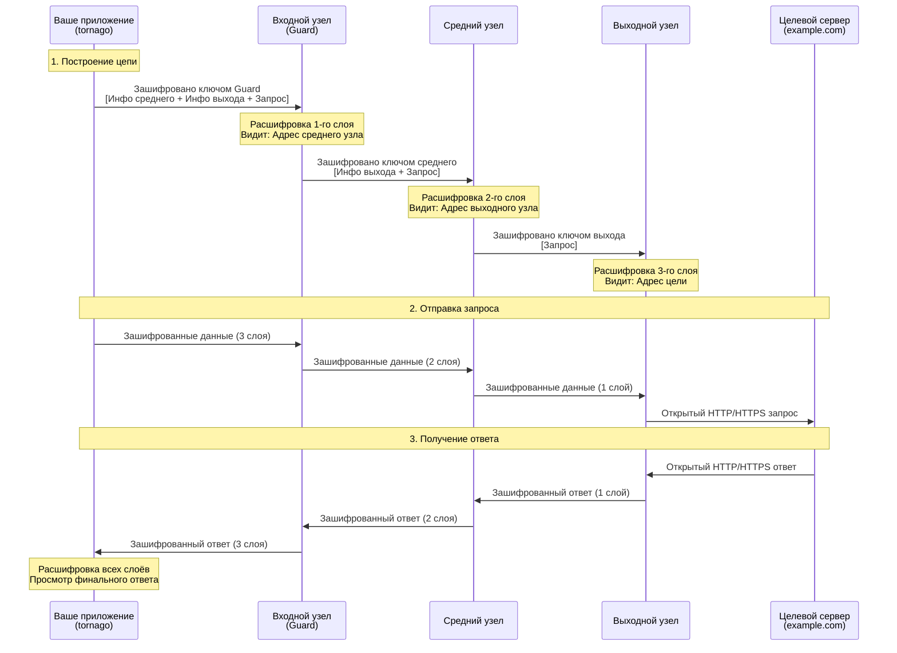

[](https://pkg.go.dev/github.com/nao1215/tornago)
[](https://goreportcard.com/report/github.com/nao1215/tornago)


[English](../../README.md) | [日本語](../ja/README.md) | [Español](../es/README.md) | [Français](../fr/README.md) | [한국어](../ko/README.md) | [中文](../zh-cn/README.md)

# tornago


Tornago — это легкая обёртка вокруг инструмента командной строки [Tor](https://www.torproject.org/), предоставляющая три основные функции:

- **Управление демоном Tor**: Запуск и управление процессами Tor программно
- **Клиент Tor**: Маршрутизация HTTP/TCP трафика через прокси SOCKS5 Tor с автоматическими повторами
- **Сервер Tor**: Создание и управление скрытыми сервисами (onion-сервисы) через ControlPort Tor

Библиотека разработана как для разработки (запуск временных экземпляров Tor), так и для продакшена (подключение к существующим развёрнутым Tor). Успешно протестирована в Linux, macOS, Windows и основных вариантах BSD.

## Почему tornago?

Я создал tornago после того, как узнал о необходимости сканирования даркнета в контексте предотвращения мошенничества с кредитными картами -- я работаю в команде по борьбе с мошенничеством. Хотя Python обычно используется для сканирования на основе Tor, я предпочитаю Go за его стабильность и надёжность в производственных средах, поэтому мне нужна была библиотека Go для этой цели.

Чтобы предотвратить возможное злоупотребление, tornago намеренно оставлен в виде тонкой обёртки вокруг оригинального инструмента командной строки Tor. Я намеренно ограничил его удобные функции, чтобы минимизировать риск злоупотребления.

> [!IMPORTANT]
> **Юридическое уведомление**: Эта библиотека предназначена только для законных целей, таких как защита конфиденциальности, исследования безопасности и разрешённая деятельность по предотвращению мошенничества. Пользователи несут единоличную ответственность за обеспечение соответствия их использования Tor и этой библиотеки всем применимым законам и нормативным актам. Не используйте этот инструмент для каких-либо незаконных действий.

## Возможности

- Нулевые внешние зависимости Go. Построено только на стандартной библиотеке
- Интерфейсы, совместимые с `net.Listener`, `net.Addr`, `net.Dialer` для легкой интеграции
- Паттерн функциональных опций для конфигурации
- Структурированные ошибки с поддержкой `errors.Is`/`errors.As`
- Автоматический повтор с экспоненциальной задержкой
- Опциональный сбор метрик и ограничение скорости
- Требуется только бинарный файл Tor в качестве внешней зависимости

## Как работает Tor

Tor (The Onion Router) обеспечивает анонимность, маршрутизируя трафик через несколько зашифрованных слоёв. Понимание этого механизма помогает эффективно использовать tornago.

### Луковая маршрутизация: Многослойное шифрование



### Ключевые свойства безопасности

**Многослойное шифрование (луковые слои)**
- Каждый ретранслятор знает только своего непосредственного предшественника и преемника
- Входной узел (Guard) знает ваш IP, но не ваше назначение
- Выходной узел знает ваше назначение, но не ваш IP
- Средний узел не знает ни вашего IP, ни назначения

**Гарантии конфиденциальности**
- Ваш провайдер видит: Вы подключаетесь к входному узлу Tor (но не к чему вы обращаетесь)
- Входной узел видит: Ваш IP-адрес (но не ваше назначение)
- Средний узел видит: Только ретрансляционный трафик (без источника или назначения)
- Выходной узел видит: Ваше назначение (но не ваш реальный IP)
- Целевой сервер видит: IP выходного узла (не ваш реальный IP)

**Ограничения для понимания**
- Выходной узел может видеть незашифрованный трафик (используйте HTTPS для сквозного шифрования)
- Операторы выходных узлов могут отслеживать трафик (но не могут отследить вас)
- Анализ времени может коррелировать шаблоны трафика (Tor обеспечивает анонимность, а не идеальную несвязываемость)
- Медленнее прямого соединения (маршрутизация через 3 узла добавляет задержку)

### Роль Tornago

Tornago упрощает интеграцию Tor, обрабатывая:

1. **Связь с прокси SOCKS5**: Автоматически маршрутизирует HTTP/TCP трафик через прокси SOCKS5 Tor
2. **Управление цепями**: Использует ControlPort для ротации цепей (получение новых выходных узлов)
3. **Создание скрытых сервисов**: Управляет адресами .onion через команды ADD_ONION/DEL_ONION

## Требования

### Go

- **Версия Go**: 1.25 или новее

### Операционные системы (протестировано в GitHub Actions)

- Linux
- macOS
- Windows
- FreeBSD
- OpenBSD
- NetBSD
- DragonFly BSD

### Tor

Tornago требует установки демона Tor в вашей системе. Библиотека протестирована с Tor версии 0.4.8.x и должна работать с новыми версиями.

**Установка:**

```bash
# Ubuntu/Debian
sudo apt update
sudo apt install tor

# Fedora/RHEL
sudo dnf install tor

# Arch Linux
sudo pacman -S tor

# macOS (Homebrew)
brew install tor
```

## Быстрый старт

См. [README на английском](../../README.md#quick-start) для полных примеров кода.

## Дополнительные примеры

Директория `examples/` содержит дополнительные рабочие примеры. Все примеры протестированы и готовы к запуску.

## Вклад

Вклады приветствуются! Подробности см. в [Руководстве по внесению вклада](../../CONTRIBUTING.md).

## Лицензия

[Лицензия MIT](../../LICENSE)

## Альтернативные библиотеки, официальные справочники

- [cretz/bine](https://github.com/cretz/bine): Библиотека Go для доступа и встраивания клиентов и серверов Tor
- [wybiral/torgo](https://github.com/wybiral/torgo): Библиотека Go для взаимодействия с Tor через стандартный интерфейс контроллера
- [torproject/stem](https://github.com/torproject/stem): Библиотека контроллера Python для Tor
- [Официальная Wiki Tor](https://gitlab.torproject.org/tpo/team/-/wikis/home)
