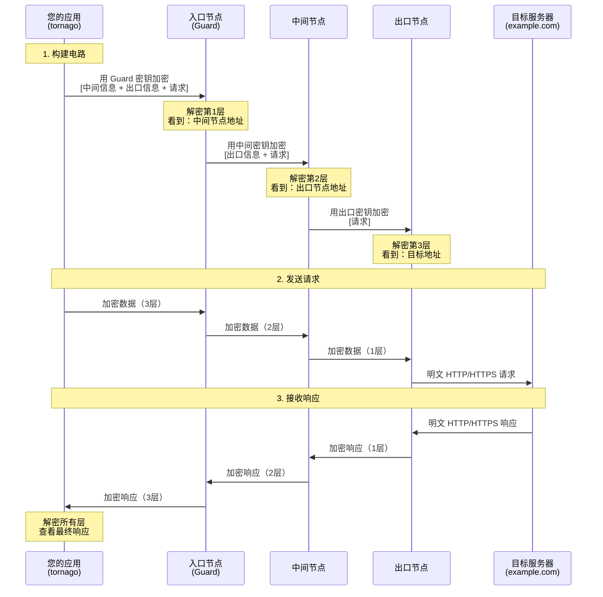

[](https://pkg.go.dev/github.com/nao1215/tornago)
[](https://goreportcard.com/report/github.com/nao1215/tornago)


[English](../../README.md) | [日本語](../ja/README.md) | [Español](../es/README.md) | [Français](../fr/README.md) | [한국어](../ko/README.md) | [Русский](../ru/README.md)

# tornago


Tornago 是 [Tor](https://www.torproject.org/) 命令行工具的轻量级包装器，提供三个核心功能：

- **Tor 守护进程管理**：以编程方式启动和管理 Tor 进程
- **Tor 客户端**：通过 Tor 的 SOCKS5 代理路由 HTTP/TCP 流量，并自动重试
- **Tor 服务器**：通过 Tor 的 ControlPort 创建和管理隐藏服务（onion 服务）

该库既适用于开发环境（启动临时 Tor 实例）也适用于生产环境（连接到现有 Tor 部署）。已在 Linux、macOS、Windows 和主要 BSD 变体上成功测试。

## 为什么创建 tornago？

在了解到信用卡欺诈防范场景中需要暗网爬虫后，我创建了 tornago（我属于反欺诈团队）。虽然 Python 通常用于基于 Tor 的爬虫，但我更喜欢 Go 在生产环境中的稳定性和健壮性，因此需要一个用于此目的的 Go 库。

为了防止潜在滥用，tornago 有意保持为原始 Tor 命令行工具的薄包装器。我故意限制了其便利功能，以最大程度降低滥用风险。

> [!IMPORTANT]
> **法律声明**：本库仅用于合法目的，如隐私保护、安全研究和经授权的欺诈防范活动。用户有责任确保其使用 Tor 和本库符合所有适用的法律法规。请勿将此工具用于任何非法活动。

## 功能

- Go 零外部依赖。仅基于标准库构建
- 兼容 `net.Listener`、`net.Addr`、`net.Dialer` 接口，易于集成
- 使用函数式选项模式进行配置
- 支持 `errors.Is`/`errors.As` 的结构化错误
- 带指数退避的自动重试
- 可选的指标收集和速率限制
- 仅需 Tor 二进制文件作为外部依赖

## Tor 工作原理

Tor（洋葱路由器）通过多层加密路由流量来提供匿名性。理解此机制有助于有效使用 tornago。

### 洋葱路由：多层加密



### 关键安全特性

**分层加密（洋葱层）**
- 每个中继只知道其直接前驱和后继
- 入口节点（Guard）知道您的 IP 但不知道目的地
- 出口节点知道目的地但不知道您的 IP
- 中间节点既不知道您的 IP 也不知道目的地

**隐私保证**
- ISP 看到：您连接到 Tor 入口节点（但不知道您访问什么）
- 入口节点看到：您的 IP 地址（但不知道目的地）
- 中间节点看到：仅中继流量（无来源或目的地）
- 出口节点看到：您的目的地（但不知道您的真实 IP）
- 目标服务器看到：出口节点的 IP（不是您的真实 IP）

**需要理解的限制**
- 出口节点可以看到未加密流量（使用 HTTPS 进行端到端加密）
- 出口节点运营商可能监控流量（但无法追溯到您）
- 时序分析可能关联流量模式（Tor 提供匿名性，而非完美不可关联性）
- 比直接连接慢（3 跳路由增加延迟）

### Tornago 的角色

Tornago 通过处理以下内容简化 Tor 集成：

1. **SOCKS5 代理通信**：自动通过 Tor 的 SOCKS5 代理路由 HTTP/TCP 流量
2. **电路管理**：使用 ControlPort 轮换电路（获取新的出口节点）
3. **隐藏服务创建**：通过 ADD_ONION/DEL_ONION 命令管理 .onion 地址

## 要求

### Go

- **Go 版本**：1.25 或更高

### 操作系统（已在 GitHub Actions 中测试）

- Linux
- macOS
- Windows
- FreeBSD
- OpenBSD
- NetBSD
- DragonFly BSD

### Tor

Tornago 需要在系统上安装 Tor 守护进程。该库已使用 Tor 版本 0.4.8.x 进行测试，应该适用于更新版本。

**安装：**

```bash
# Ubuntu/Debian
sudo apt update
sudo apt install tor

# Fedora/RHEL
sudo dnf install tor

# Arch Linux
sudo pacman -S tor

# macOS (Homebrew)
brew install tor
```

## 快速入门

完整代码示例请参见[英文 README](../../README.md#quick-start)。

## 更多示例

`examples/` 目录包含其他工作示例。所有示例均已测试并可立即运行。

## 贡献

欢迎贡献！详情请参见[贡献指南](../../CONTRIBUTING.md)。

## 许可证

[MIT 许可证](../../LICENSE)

## 替代库、官方参考

- [cretz/bine](https://github.com/cretz/bine)：用于访问和嵌入 Tor 客户端和服务器的 Go 库
- [wybiral/torgo](https://github.com/wybiral/torgo)：通过标准控制器接口与 Tor 交互的 Go 库
- [torproject/stem](https://github.com/torproject/stem)：Tor 的 Python 控制器库
- [Tor 官方 Wiki](https://gitlab.torproject.org/tpo/team/-/wikis/home)
